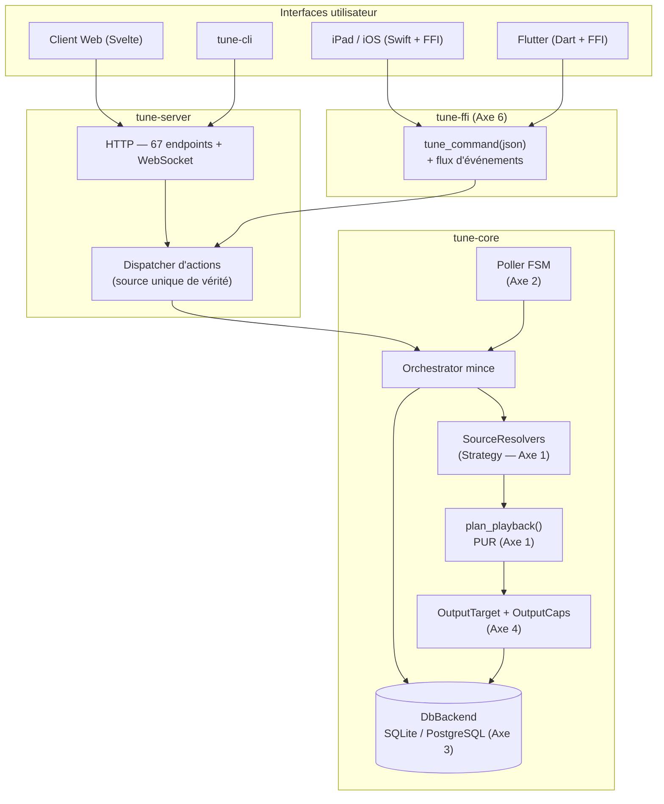
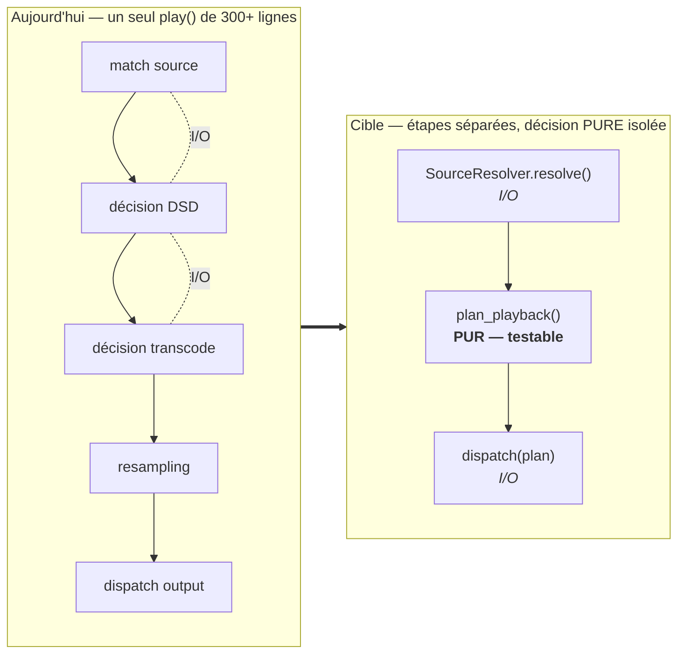
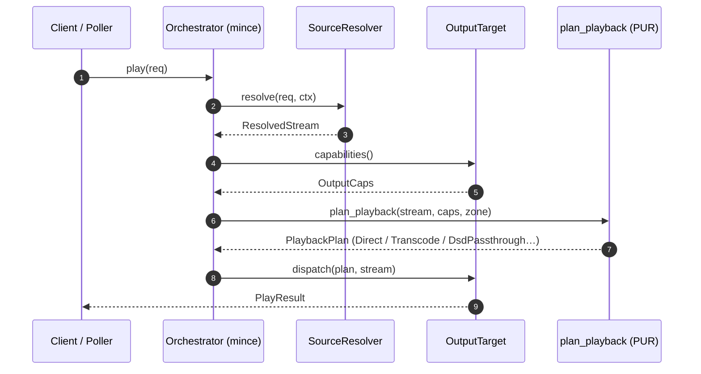
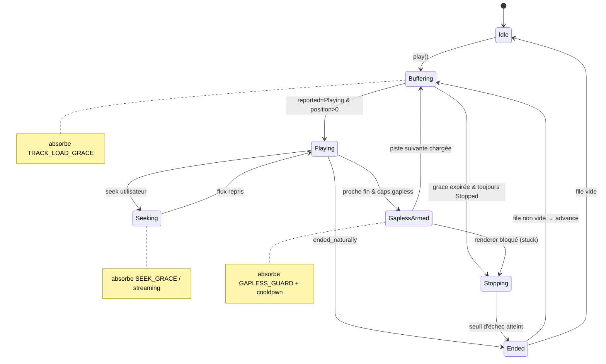
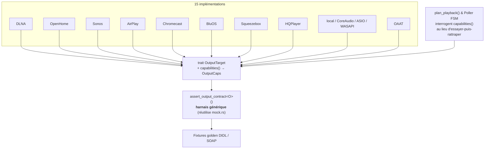
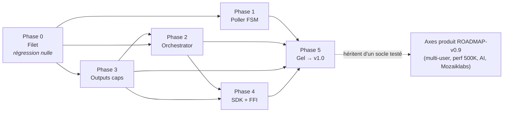

# Architecture cible v0.9 — refonte structurelle

**Statut** : Draft (2026-07-01)
**Auteur** : cadrage architecte
**Cible** : branche `release/v0.9` (trigger v0.8.50)
**Contrainte maîtresse** : **régression minimale**, ouverture aux évolutions futures.

> Ce document est le **pendant technique** de [`ROADMAP-v0.9.md`](ROADMAP-v0.9.md).
> La roadmap décrit *quelles features* on livre (Plugin SDK, multi-user, AI, perf 500K, Mozaiklabs, PostgreSQL).
> Ce document décrit *comment on rend le code prêt à les recevoir* sans casser l'existant.
> Il traite les **6 points d'attention** identifiés dans `docs/architecture-tune-server-rust.pdf`.
>
> Ne dupliquent pas ce doc : [`POSTGRES-PLAN.md`](POSTGRES-PLAN.md) (axe DB détaillé) et la RFC plugin
> (mémoire `project_tune_plugin_rfc`). On y renvoie.

---

## 0. Principe directeur : *strangler + filet de tests d'abord*

Aucune zone chaude n'est refondue sans **caractérisation préalable**. Pour chaque axe :

1. **Filet** — on fige le comportement actuel dans des tests d'or (golden / characterization) :
   séquences de poll réelles, I/O de `play()`, DIDL/SOAP émis, résultats de requêtes.
2. **Introduction parallèle** — le nouveau chemin vit derrière un **flag runtime**, ancien chemin par défaut.
3. **Bascule progressive** — on flippe **par zone**, on observe, puis on supprime l'ancien.

Invariants non négociables sur toute la durée du chantier :

- **API HTTP inchangée** (67 groupes d'endpoints) — signatures publiques = façades.
- **Surface FFI inchangée** tant que l'axe 6 n'est pas atteint.
- **SQLite reste le défaut** — la majorité des utilisateurs est dessus.
- Chaque phase est **mergeable et livrable indépendamment**. Si une phase dérape, les précédentes tiennent.

---

## Cartographie état réel → cible

| # | Zone | Fichier | LOC | Symptôme | Cible v0.9 |
|---|------|---------|-----|----------|-----------|
| 1 | Orchestrator | `tune-core/src/orchestrator.rs` | 4342 | God-object, `play()` = gros `match` source/format/DSD, non testable sans I/O | Resolvers (Strategy) + planner pur |
| 2 | Poller | `tune-core/src/poller.rs` | 1811 | FSM implicite : `ZonePollState` = **23 champs** de flags/timers ad hoc | FSM explicite + fonction `transition` pure |
| 3 | Double BDD | `tune-core/src/db/*` | ~8000 | Placeholders déjà centralisés (`Dialect::placeholder`), mais **migrations SQL brut** sans test cross-engine | Conformité dual-engine en CI (voir POSTGRES-PLAN) |
| 4 | Outputs | `tune-core/src/outputs/*` (15 impls) | 11749 | Capacités implicites (`play_media` défaut = `"not implemented"`), couverture inégale | `OutputCaps` explicites + harnais de conformité |
| 5 | Plugins | `tune-core/src/plugin_sdk.rs` | — | Compilé en dur via features ; PDF « dynamique/marketplace » = aspirationnel | Contrat `tune-plugin-sdk` semver (voir RFC) |
| 6 | FFI | `tune-ffi/src/lib.rs` | 213 | 4 fonctions C ; Swift/Flutter réimplémentent la logique | Bus de commandes JSON + flux d'événements |
| — | Legacy | `tune-pyo3/` | — | **Hors `workspace.members`**, orphelin (serveur Python abandonné) | Sortir du repo |
| — | Erreurs | transverse | — | `Result<_, String>` aux frontières → intestable | Erreurs typées `thiserror` |

### Vue d'ensemble cible



---

## Axe 1 — Orchestrator → resolvers + planner

### Problème
`PlaybackOrchestrator::play()` (lignes 143→465) enchaîne : résolution de source (`match` sur local /
streaming / upload), décision DSD passthrough, décision transcodage, resampling, dispatch output — le tout
mêlant I/O réseau/disque et logique de décision. Impossible à tester sans monter une vraie DB + un vrai output.



### Cible

**a) Résolution de source — pattern Strategy.**

```rust
// tune-core/src/playback/resolve.rs (nouveau)
pub struct ResolveCtx<'a> {
    pub advertised_ip: &'a str,
    pub services: &'a ServiceRegistry,
    pub streamer: &'a AudioStreamer,
    // ... deps explicites, pas de &self god-object
}

#[async_trait]
pub trait SourceResolver: Send + Sync {
    /// Sources gérées : "local", "qobuz", "tidal", "upload", ...
    fn handles(&self, source: &str) -> bool;
    async fn resolve(&self, req: &PlayRequest, ctx: &ResolveCtx<'_>) -> Result<ResolvedStream, PlayError>;
}

// Impls : LocalResolver, StreamingResolver, UploadResolver
// Remplacent le match des lignes 143-465.
```

`ResolvedStream` (déjà défini `orchestrator.rs:60`) reste le type de sortie — **pas de changement de contrat**.

**b) Décision de préparation — planner PUR (pas d'I/O).**

```rust
// tune-core/src/playback/plan.rs (nouveau)
#[derive(Debug, Clone, PartialEq)]
pub struct PlaybackPlan {
    pub delivery: Delivery,          // Direct | Transcode { to } | DsdPassthrough | DsdToPcm
    pub target_mime: String,
    pub sample_rate: Option<u32>,
    pub bit_depth: Option<u32>,
}

/// Fonction PURE : (stream résolu, capacités de l'output, prefs zone) -> plan.
/// Testable exhaustivement sans réseau ni disque.
pub fn plan_playback(stream: &StreamProps, caps: &OutputCaps, zone: &ZonePrefs) -> PlaybackPlan;
```

Toute la logique DSD (`should_dsd_passthrough`, `dlna_supports_mime`, choix transcode) migre ici sous
forme de tables de décision testables. `plan_playback` devient le **cœur documenté** du routage audio —
c'est ce que le PDF appelait « candidat au pattern Strategy » pour l'Orchestrator.

**c) Orchestrator = coordinateur mince.**

```rust
impl PlaybackOrchestrator {
    pub async fn play(&self, req: PlayRequest) -> Result<PlayResult, PlayError> {
        let stream = self.resolvers.resolve(&req, &self.ctx()).await?;   // Axe 1a
        let caps   = self.outputs.caps(&device_id).await;                // Axe 4
        let plan   = plan_playback(&stream.props(), &caps, &zone_prefs); // Axe 1b — pur
        self.dispatch(plan, stream, &device_id).await                    // I/O
    }
}
```

Signature publique **identique** → zéro régression appelants (poller, routes HTTP).



### Test / non-régression
- Golden : enregistrer les `(PlayRequest, ResolvedStream, PlaybackPlan)` produits par 30-40 cas réels
  (local FLAC, DSD64 passthrough, DSD→PCM, Tidal AAC→FLAC pour DLNA, upload…) avant refonte.
- `plan_playback` : table de tests unitaires exhaustive (matrice format × output caps × dsd_mode).

### Ouverture future
Nouveau service de streaming = nouvel `impl SourceResolver` enregistré, sans toucher l'orchestrator.
Nouveau format = nouvelle ligne dans la table de `plan_playback`.

---

## Axe 2 — Poller → machine à états explicite *(priorité n°1 anti-bugs)*

### Problème
`ZonePollState` porte **23 champs** : `gapless_sent`, `gapless_cooldown`, `gapless_sent_at`,
`gapless_advance_pending`, `gapless_stuck_ticks`, `stopped_ticks`, `past_end_ticks`,
`track_started_at`, `track_loaded_at`, `peak_position_ms`, `volume_changed_at`… plus ~12 constantes de
*grace period* (`SEEK_GRACE_SECS`, `TRACK_LOAD_GRACE_SECS`, `GAPLESS_GUARD_SECS`,
`STOPPED_FAILURE_THRESHOLD`, `POSITION_PAST_END_TICKS`…). C'est un automate implicite, débogué par
accrétion de flags — la cause racine des bugs « zones disparues » et gapless erratique.

### Cible : FSM séparée de l'I/O



Les gardes ci-dessus (les « notes ») sont exactement les *grace periods* aujourd'hui éparpillées en
constantes globales — désormais nommées et localisées sur les transitions concernées.

```rust
// tune-core/src/playback/fsm.rs (nouveau) — AUCUN accès réseau/DB ici
#[derive(Debug, Clone, PartialEq)]
pub enum ZoneState {
    Idle,
    Buffering { since: Tick, generation: u64 },   // absorbe TRACK_LOAD_GRACE
    Playing   { peak_ms: u64 },
    Seeking   { since: Tick, streaming: bool },    // absorbe SEEK_GRACE / SEEK_STREAMING_GRACE
    GaplessArmed { sent_at: Tick, next_id: i64 },  // absorbe GAPLESS_GUARD + cooldown
    Stopping  { ticks: u8 },                        // absorbe STOPPED_FAILURE_THRESHOLD
    Ended,
}

/// Entrée d'un tick : tout ce que la boucle a observé, normalisé.
pub struct PollInput {
    pub now: Tick,
    pub reported: TransportState,   // depuis OutputStatus
    pub position_ms: u64,
    pub duration_ms: u64,
    pub ended_naturally: bool,      // depuis OutputStatus.ended_naturally
    pub generation: u64,
    pub user_seeked_at: Option<Tick>,
    pub volume_changed_at: Option<Tick>,
}

/// Sortie : effets à exécuter par la boucle (elle seule fait de l'I/O).
pub enum Action {
    AdvanceQueue,
    ArmGapless { next_id: i64 },
    ForcePlayFromQueue,
    SavePosition(u64),
    EmitEvent(ZoneEvent),
    StopZone,
}

/// LE cœur : PURE, déterministe, testable avec des séquences de ticks synthétiques.
pub fn transition(state: ZoneState, input: &PollInput, cfg: &PollCfg) -> (ZoneState, Vec<Action>);
```

La boucle 1 Hz (`PositionPoller::spawn`) se réduit à trois étapes :

```rust
let input = collect_input(&zone).await;               // I/O : get_status, timers
let (next, actions) = transition(state, &input, cfg); // PUR
for a in actions { self.execute(a, &zone).await; }    // I/O : advance, save, emit
state = next;
```

Les 23 champs deviennent : **l'enum d'état** + un petit `PollTimers`. Les *grace periods* deviennent des
**gardes explicites** sur les transitions, nommées et documentées une seule fois.

### Test / non-régression
- **Filet d'abord** : instrumenter le poller actuel pour dumper `(PollInput, décision)` sur des lectures
  réelles (local gapless, DLNA Eversolo, Tidal transcodé, radio, seek streaming). Rejouer ces traces.
- `transition` : tests unitaires par scénario (gapless nominal, faux-Stopped renderer lent, seek qui
  reset la position, fin naturelle locale, échec de buffering → StopZone).
- Bascule **par zone** via flag `poller_fsm=on` : on compare FSM vs legacy en shadow avant de flipper.

### Ouverture future
Nouveau comportement de renderer = nouvelle garde/transition isolée et testée, pas un 24ᵉ flag.
La FSM est réutilisable pour la synchro multiroom OAAT (états de groupe).

---

## Axe 3 — Double BDD : *fencer, pas réécrire*

> Plan détaillé et à jour : [`POSTGRES-PLAN.md`](POSTGRES-PLAN.md). Ici, seul l'angle **anti-régression**.

### Constat corrigé
Les placeholders **sont déjà** centralisés (`Dialect::placeholder(n)`, ~519 sites cohérents) — ce n'est
pas le point de dérive. Le vrai risque : les **migrations en SQL brut** (`MIGRATIONS: &[Migration]`,
`db/migrations.rs`, ~55 `CREATE`) doivent rester valides sur SQLite *et* Postgres, sans garde-fou.

### Cible
1. **Migrations séparées par dialecte** (`migrations/sqlite/`, `migrations/postgres/`) — déjà prévu POSTGRES-PLAN.
2. **Suite de conformité dual-engine en CI** : *les mêmes* tests d'intégration repository tournent en
   matrix `{sqlite, postgres16}`. Toute divergence = build rouge, pas bug prod. C'est le garde-fou
   structurel manquant.
3. Garder `rusqlite` (SQLite, perf embarqué) + `sqlx` (Postgres) derrière le trait `DbBackend` existant —
   **on ne réécrit pas la couche data** (réécriture = régression garantie sur 14 repos).

### Non négociable
- SQLite reste le défaut ; aucune régression SQLite tolérée (critère POSTGRES-PLAN déjà posé).
- `query_many_strong` / `query_one_strong` (fix WAL snapshot, bugs forum #2/#6) : couverts par la suite
  de conformité pour éviter toute reviviscence.

### Ouverture future (post-v1)
`sqlx query!` compile-time ou SeaORM = option v1.x seulement, hors scope v0.9.

---

## Axe 4 — Outputs : capacités explicites + harnais de conformité

### Problème
15 impls derrière `OutputTarget`. Les capacités sont **implicites** : `play_media` par défaut renvoie
`"not implemented"`, `set_next_url` par défaut renvoie `Ok(())` silencieux. L'orchestrator/poller
« essaient puis rattrapent ». `local.rs` fait 3986 LOC. Couverture de tests très inégale (DLNA a
`dlna_test.rs`, la plupart n'ont rien).

### Cible

**a) Capacités déclaratives.**

```rust
// tune-core/src/outputs/traits.rs (ajout)
#[derive(Debug, Clone, Copy, Default)]
pub struct OutputCaps {
    pub gapless: bool,          // set_next_media effectif ?
    pub seek: bool,
    pub volume: bool,
    pub set_volume_db: bool,
    pub dsd_passthrough: bool,
    pub reports_ended_naturally: bool,
    pub max_sample_rate: Option<u32>,
}

pub trait OutputTarget: Send + Sync {
    fn capabilities(&self) -> OutputCaps;   // NOUVEAU — plus de "essaie puis rattrape"
    // ... surface existante inchangée
}
```

`plan_playback` (Axe 1b) et la FSM (Axe 2) **interrogent** `capabilities()` au lieu de tenter puis
gérer l'échec. Ex : `GaplessArmed` n'est atteignable que si `caps.gapless`.

**b) Harnais de conformité générique.**

```rust
// tune-core/src/outputs/conformance.rs (nouveau)
/// Suite paramétrée sur n'importe quel OutputTarget. Réutilise mock.rs.
/// Vérifie le contrat : play→status Playing, pause/resume, stop→Stopped,
/// volume clamp [0,1], seek borné, cohérence caps↔comportement.
pub async fn assert_output_contract<O: OutputTarget>(make: impl Fn() -> O);
```

Chaque protocole (DLNA, OpenHome, Sonos, AirPlay, Chromecast, BluOS, Squeezebox, HQPlayer, local,
CoreAudio/ASIO/WASAPI exclusif, OAAT, bridge) fournit un test qui appelle `assert_output_contract` +
des **fixtures golden** (DIDL/SOAP attendu pour les protocoles UPnP). Nivelle la couverture sans
réécrire les 15 impls.



### Test / non-régression
- Golden DIDL/SOAP capturés depuis le code actuel avant tout changement (`didl.rs`, `dlna.rs`).
- `capabilities()` : valeurs vérifiées contre le comportement réel via le harnais (une cap qui ment = test rouge).

### Ouverture future
Nouveau protocole de sortie = `impl OutputTarget` + `capabilities()` + un test `assert_output_contract`.
C'est aussi le point d'extension « sorties audio » du Plugin SDK (Axe 5).

---

## Axe 5 — Plugins : stabiliser le contrat (voir RFC)

> Plan produit : [`ROADMAP-v0.9.md`](ROADMAP-v0.9.md) axe 1. Détail technique : mémoire `project_tune_plugin_rfc`.
> Ici, seul le **positionnement architecture**.

### Constat
`TunePlugin` (`plugin_sdk.rs`) existe et fonctionne, mais **compilé en dur** : pas de `libloading`, pas de
marketplace. Le PDF (« chargement dynamique sans recompilation », « marketplace ») décrit une cible, pas le réel.

### Cible v0.9 (aligne roadmap axe 1)
- Extraire un crate `tune-plugin-sdk` **versionné SemVer**, publié crates.io.
- Formaliser les **8 points d'extension** en traits typés — dont « sorties audio » qui **réutilise `OutputTarget` + `OutputCaps` de l'Axe 4**, et « décodeurs » qui réutilise le trait décodeur audio existant.
- Manifest de permissions **déclaratif** (TOML) — même si non appliqué finement en v0.9 (roadmap : sandbox = out), il fixe le contrat pour v1.
- Loader dynamique `libloading` (cdylib) : **in** roadmap axe 1, mais avec la mitigation ABI déjà actée
  (plugins officiels compilés dans le même CI que le serveur, binaires alignés uniquement).

### Hors scope v0.9 (post-v1)
Hot-reload, sandbox/permissions fines, marketplace. Le contrat SDK doit néanmoins être posé pour ne pas
casser les plugins tiers plus tard → **le figer = la vraie valeur v0.9**.

---

## Axe 6 — FFI : bus de commandes, pas 4 fonctions de plus

### Problème
`tune-ffi/src/lib.rs` = 213 LOC, **4 fonctions** (`start`/`stop`/`status`/`version`). Toute la logique
métier est côté serveur HTTP ; Swift (iPad/iOS/macOS) et Flutter la ré-atteignent chacun via HTTP local,
ou pire, réimplémentent des bouts. Contraire à ta préférence « auto-port » (une feature portée partout
dans la même session).

### Cible : surface FFI stable et générique

```rust
// tune-ffi/src/lib.rs (ajout, sans retirer l'existant)

/// Exécute une commande JSON contre le serveur embarqué, retourne un JSON.
/// Nouvelle route interne = automatiquement dispo côté Swift/Flutter, SANS
/// ajouter de fonction C. C'est le cœur de l'"auto-port".
#[no_mangle]
pub extern "C" fn tune_command(json_in: *const c_char) -> *mut c_char;

/// Ouvre un flux d'événements (now-playing, zones, scan progress) via callback.
/// Remplace le polling HTTP côté clients embarqués.
#[no_mangle]
pub extern "C" fn tune_subscribe_events(cb: extern "C" fn(*const c_char), token: u64) -> i32;

#[no_mangle]
pub extern "C" fn tune_unsubscribe_events(token: u64) -> i32;
```

`tune_command` route en interne vers **le même dispatcher que l'API HTTP** (une seule source de vérité
d'actions). Les 4 fonctions existantes restent → **zéro régression** des apps déjà buildées.

### Ouverture future
`uniffi` (bindings Swift/Kotlin typés générés) reste une option si le JSON devient limitant, mais le bus
JSON couvre 95 % du besoin à coût quasi nul et sans casser l'ABI existante.

---

## Transverse — erreurs typées & nettoyage

- **`thiserror`** (déjà en dep) aux frontières de module : `PlayError`, `ResolveError`, `OutputError`,
  `DbError`. Remplace `Result<_, String>` — prérequis de testabilité des axes 1/2/4. Migration
  incrémentale, module par module, `impl From<_> for _` pour ne rien casser côté appelants.
- **Sortir `tune-pyo3`** du repo (serveur Python abandonné, déjà hors `workspace.members`). Ramène le
  projet à **5 modules réels** (`tune-core`, `tune-server`, `tune-cli`, `tune-ffi`, `tune-bridge`) —
  et corrige le PDF qui en annonce 6.

---

## Séquencement (branche `release/v0.9`, features gelées à v0.8.50)



| Phase | Contenu | Régression | Dépend de |
|-------|---------|-----------|-----------|
| **0 — Filet** | Harnais caractérisation (poller/orchestrator/outputs) + CI conformité dual-engine + erreurs typées aux frontières | Zéro (aucun changement de comportement) | — |
| **1 — Poller FSM** | `fsm.rs` + `transition` pur, bascule par zone via flag | Faible (shadow compare) | Phase 0 |
| **2 — Orchestrator** | `SourceResolver` + `plan_playback` pur | Faible (golden plan) | Phase 0, 4a |
| **3 — Outputs caps** | `OutputCaps` + harnais conformité | Faible (golden DIDL) | Phase 0 |
| **4 — SDK + FFI** | `tune-plugin-sdk` semver + `tune_command` bus | Nulle (ajouts, pas retraits) | Phases 2, 3 |
| **5 — Gel & stabilisation** | Suppression des anciens chemins flippés, doc, cahier de recette → v1.0 | — | Toutes |

Note d'ordonnancement : **4a (OutputCaps) avant 2 (planner)** car `plan_playback` consomme les caps.
Les axes produit de `ROADMAP-v0.9.md` (multi-user, perf 500K, AI, Mozaiklabs) se branchent **après** —
ils héritent d'un socle testé plutôt que de l'aggraver.

---

## Critères de sortie v0.9 (architecture)

- `orchestrator.rs` < 1500 LOC ; logique de routage dans `plan_playback` pur couvert à 100 % branches.
- `poller.rs` : plus aucun flag ad hoc ; `transition` couvert par ≥ 20 scénarios de ticks.
- CI conformité dual-engine **verte sur 3 derniers tags** (repris de POSTGRES-PLAN).
- Harnais `assert_output_contract` passé par les 15 impls.
- `tune-plugin-sdk` publié, un plugin tiers buildable hors-arbre en < 2h (repris roadmap axe 1).
- `tune_command` : au moins une feature portée iPad+Flutter sans ajout de fonction C.
- `tune-pyo3` supprimé ; PDF corrigé (5 modules).
- **Zéro régression** mesurée sur le cahier de recette v0.8.x.

---

*Document évolutif. À relire avec la roadmap produit avant ouverture de `release/v0.9`.*
