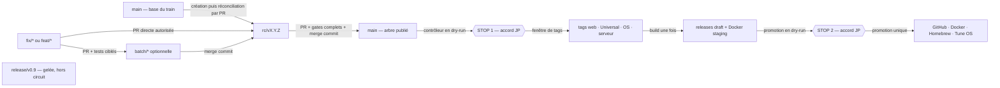
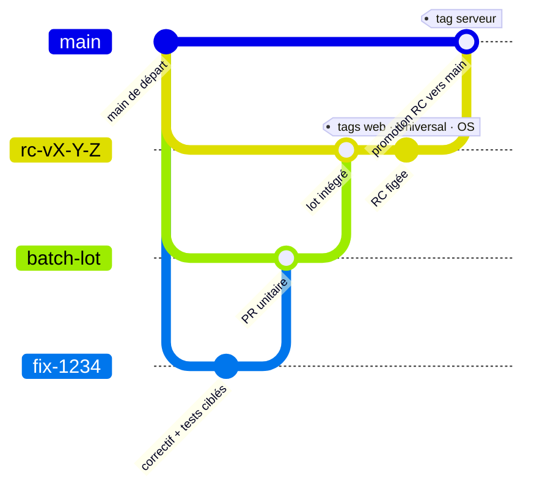

# Opérations de release — runbook

Ce runbook décrit le circuit courant des quatre dépôts Tune. La doctrine et
les responsabilités sont fixées dans
[`tune-gouvernance/regles/RELEASE.md`](https://github.com/renesenses/tune-gouvernance/blob/main/regles/RELEASE.md).

`release/v0.9`, les tags manuels et la publication directe appartiennent à
l'ancien circuit. Ne jamais exécuter `git tag` ou `git push --tags` pour une
release normale.

## Vue d'ensemble



### Vue Git — plan de métro

Ce graphe superpose le trajet commun des quatre dépôts. La branche
`batch/*` est facultative : sans lot, la PR de correctif rejoint directement
la RC.



Les tags sont créés après la promotion : le dessin indique leur **cible Git**,
pas leur instant de création. Web, Universal et OS taguent la tête figée de
leur RC, désormais ancêtre de `main`; le serveur tague le commit de fusion sur
`main`. `release/v0.9` ne rejoint plus cette ligne.

Les quatre composants sont `server`, `web`, `os` et `universal`. Le serveur
porte le manifeste `.release/vX.Y.Z.json` et orchestre les tags ainsi que la
promotion. Android est hors de ce manifeste : il n'est ni bumpé, ni tagué, ni
publié automatiquement par ce train.

## 1. Configuration permanente

### Branches

Les dépôts publics `tune-server-rust` et `tune-web-client` protègent `main` et
`rc/*` par ruleset :

- PR obligatoire et conversations résolues ;
- seule méthode `merge` ;
- force-push et suppression interdits ;
- contrôles requis vérifiés par `audit-protections.yml`.

Les dépôts privés `tune-os` et `tune-server-universal` relèvent de l'exception
GitHub Free : seuls JP et Bertrand fusionnent ou taguent. Les agents ne le
font jamais.

### Environnements et armements

Le dépôt serveur porte trois environnements :

| environnement | rôle |
|---|---|
| `release-dry-run` | lecture et validation, sans approbation |
| `release` | création des quatre tags, avec approbation JP ou Bertrand |
| `release-promotion` | publication des canaux stables, avec approbation |

Les variables de dépôt restent désarmées hors de leur fenêtre :

```text
RELEASE_CONTROLLER_ENABLED=false
RELEASE_PROMOTION_ENABLED=false
```

`RELEASE_CONTROLLER_TOKEN` est un secret d'environnement : lecture seule dans
`release-dry-run`, lecture/écriture des références dans `release`. Les deux
jetons voient les quatre dépôts. Les autres secrets de build et de publication
restent dans leurs environnements existants.

## 2. Préparer un train

1. Créer `rc/vX.Y.Z` dans chacun des quatre dépôts depuis la base décidée.
2. Faire viser les PR de travail vers leur branche de lot ou la RC assignée.
   Les PR unitaires exécutent leurs tests ciblés.
3. Intégrer chaque lot dans la RC par commit de fusion. La RC porte la batterie
   d'intégration, pas chaque petit correctif pris isolément.
4. Réconcilier chaque RC avec son `main` par PR. Une RC ne doit retirer aucun
   correctif déjà présent dans `main`.
5. Bumper les versions web et serveur dans leurs fichiers canoniques.
6. Relever les têtes exactes des RC web, OS et Universal dans
   `.release/vX.Y.Z.json`. Le serveur conserve `"sha": "self"`.
7. Passer `ready=true` seulement quand les quatre RC sont figées.

Avec `ready=true`, une RC qui avance rend l'audit rouge. Mettre le SHA à jour
par PR et rejouer les gates ; ne jamais ignorer cet échec.

## 3. Auditer puis promouvoir vers `main`

Lancer l'audit depuis la RC serveur :

```bash
gh workflow run audit-protections.yml \
  --repo renesenses/tune-server-rust \
  --ref rc/vX.Y.Z \
  --field version=X.Y.Z
```

Il doit confirmer les rulesets publics, leurs paramètres, les armements à
`false`, l'absence de tag et l'alignement du manifeste. OS et Universal
peuvent apparaître `NON VÉRIFIÉ` avec `github.token` ; le contrôleur les lira
ensuite avec son jeton inter-dépôts.

Ouvrir et fusionner par commit de fusion les promotions dans cet ordre :

1. web `rc/vX.Y.Z` vers `main` (`npm test`, build de production et références
   d'issues) ;
2. Universal `rc/vX.Y.Z` vers `main` ;
3. OS `rc/vX.Y.Z` vers `main` ;
4. serveur `rc/vX.Y.Z` vers `main` en dernier, avec la batterie complète,
   `Test (PostgreSQL)`, `Issues déclarées corrigées` et `release-gate` verts.

Les SHA web, OS et Universal du manifeste sont alors des ancêtres identifiables
de leurs `main`. Le contrôleur résout `server:self` vers la tête exacte du
`main` serveur.

## 4. Premier dry-run et premier STOP

Depuis `main` serveur :

```bash
gh workflow run release-controller.yml \
  --repo renesenses/tune-server-rust \
  --ref main \
  --field version=X.Y.Z \
  --field dry_run=true
```

Le run doit :

- lire les quatre dépôts, privés compris ;
- vérifier que chaque SHA est contenu dans `main` ;
- refuser un tag existant sur un autre SHA ;
- annoncer les quatre tags qu'il créerait ;
- ne rien modifier.

Conserver le rapport et vérifier indépendamment : aucun tag, gel actif,
`RELEASE_CONTROLLER_ENABLED=false` et `RELEASE_PROMOTION_ENABLED=false`.

**STOP. Aucun tag sans accord explicite de JP.**

## 5. Créer les tags et construire le staging

Après accord explicite seulement :

1. noter l'état du ruleset de gel des tags et ouvrir uniquement cette fenêtre ;
2. passer `RELEASE_CONTROLLER_ENABLED=true` ;
3. lancer le contrôleur avec `dry_run=false` depuis le même `main` ;
4. approuver l'environnement `release` ;
5. laisser le contrôleur créer, dans l'ordre, les tags web, Universal, OS puis
   serveur ;
6. repasser immédiatement l'armement à `false` et remettre le gel, même après
   un échec partiel.

```bash
gh workflow run release-controller.yml \
  --repo renesenses/tune-server-rust \
  --ref main \
  --field version=X.Y.Z \
  --field dry_run=false
```

Le tag serveur est posé en dernier et déclenche le train. Le staging attendu
est :

- release serveur en brouillon, matrice complète, checksums et signatures ;
- Docker uniquement sous `staging-vX.Y.Z` ;
- release Tune OS en brouillon avec les trois images et leurs sommes ;
- aucun déplacement de `latest`, Homebrew ou autre canal stable.

Le contrôleur est idempotent : un tag déjà placé sur le SHA attendu est
accepté. Un tag divergent bloque et ne doit jamais être déplacé en silence.

## 6. Vérifier le staging et second STOP

Quand tous les builds sont terminés :

```bash
gh workflow run promote-release.yml \
  --repo renesenses/tune-server-rust \
  --ref main \
  --field version=X.Y.Z \
  --field dry_run=true
```

Le workflow vérifie notamment :

- les quatre cibles de tags ;
- le manifeste contenu dans le tag serveur ;
- tous les actifs serveur, checksums et signature Minisign ;
- les trois images OS et leurs sommes ;
- l'image Docker `staging-vX.Y.Z` ;
- la formule Homebrew calculée depuis les checksums staged.

**STOP. Aucune publication publique sans un second accord explicite de JP.**

## 7. Promouvoir une seule fois

Après ce second accord :

1. passer `RELEASE_PROMOTION_ENABLED=true` ;
2. lancer `promote-release.yml` avec `dry_run=false` ;
3. approuver `release-promotion` ;
4. repasser immédiatement l'armement à `false`.

La promotion recopie le digest Docker staged vers `vX.Y.Z` et `latest`, publie
les releases OS et serveur, met Homebrew à jour puis envoie la notification.
Elle ne reconstruit pas les binaires.

## 8. Vérification et clôture

Une release est terminée après preuve des éléments suivants :

- les quatre tags pointent les SHA du rapport ;
- les releases GitHub et leurs actifs sont publics et complets ;
- les sommes et signatures sont valides ;
- Docker `vX.Y.Z` et `latest` portent le digest staged ;
- Homebrew référence la bonne version et les bonnes sommes ;
- Tune OS installe le serveur épinglé, sans résoudre `releases/latest` ;
- les deux variables sont à `false` et le gel des tags est actif.

Supprimer les RC et fermer les issues de vérification seulement après ces
preuves.

## 9. Échec et reprise

- Avant les tags : corriger par PR, refaire le manifeste et le dry-run.
- Pendant les tags : désarmer, remettre le gel, relever les tags déjà créés,
  corriger la cause puis relancer le contrôleur idempotent.
- Pendant le staging : ne publier aucun canal ; corriger ou retirer le train.
- Après publication : lancer d'abord `rollback.yml` en dry-run, faire valider
  son rapport, puis seulement appliquer le rollback autorisé.

Ne jamais supprimer ou déplacer un tag publié pour rendre un rapport vert.

## 10. Règle pour les agents

Un agent OpenAI ou Claude peut préparer du code, des tests et une PR vers la
base assignée. Sans instruction humaine explicite portant sur l'étape précise,
il ne fusionne pas une promotion, ne touche pas aux rulesets, environnements,
secrets ou armements, ne crée aucun tag et ne publie rien.

Les fichiers `AGENTS.md` et `CLAUDE.md` des quatre dépôts renvoient à cette
règle. La procédure complète n'y est pas dupliquée.
