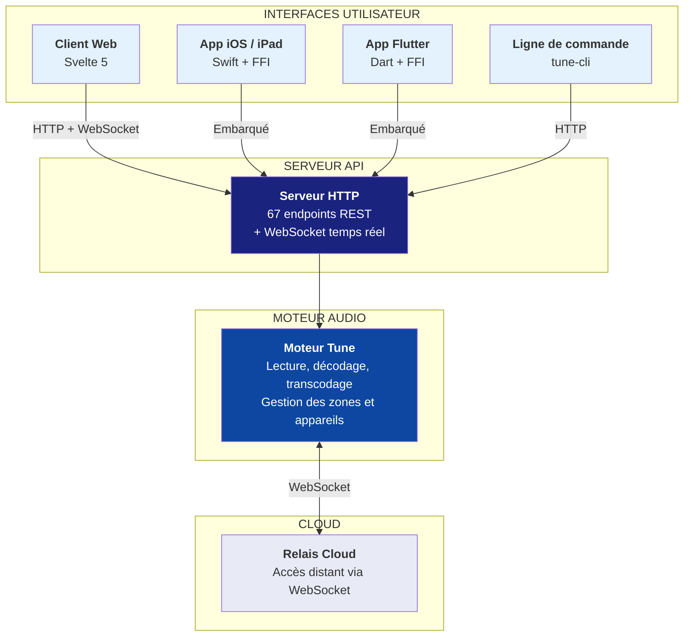
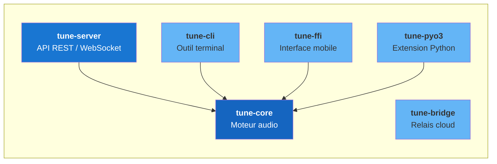
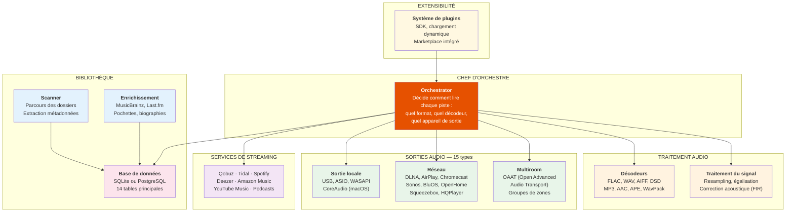
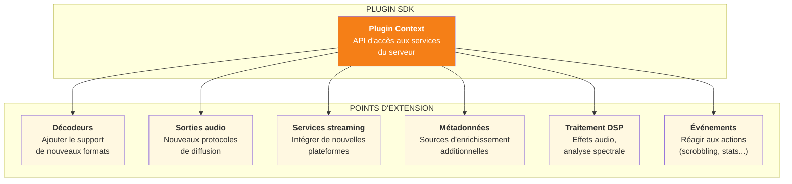
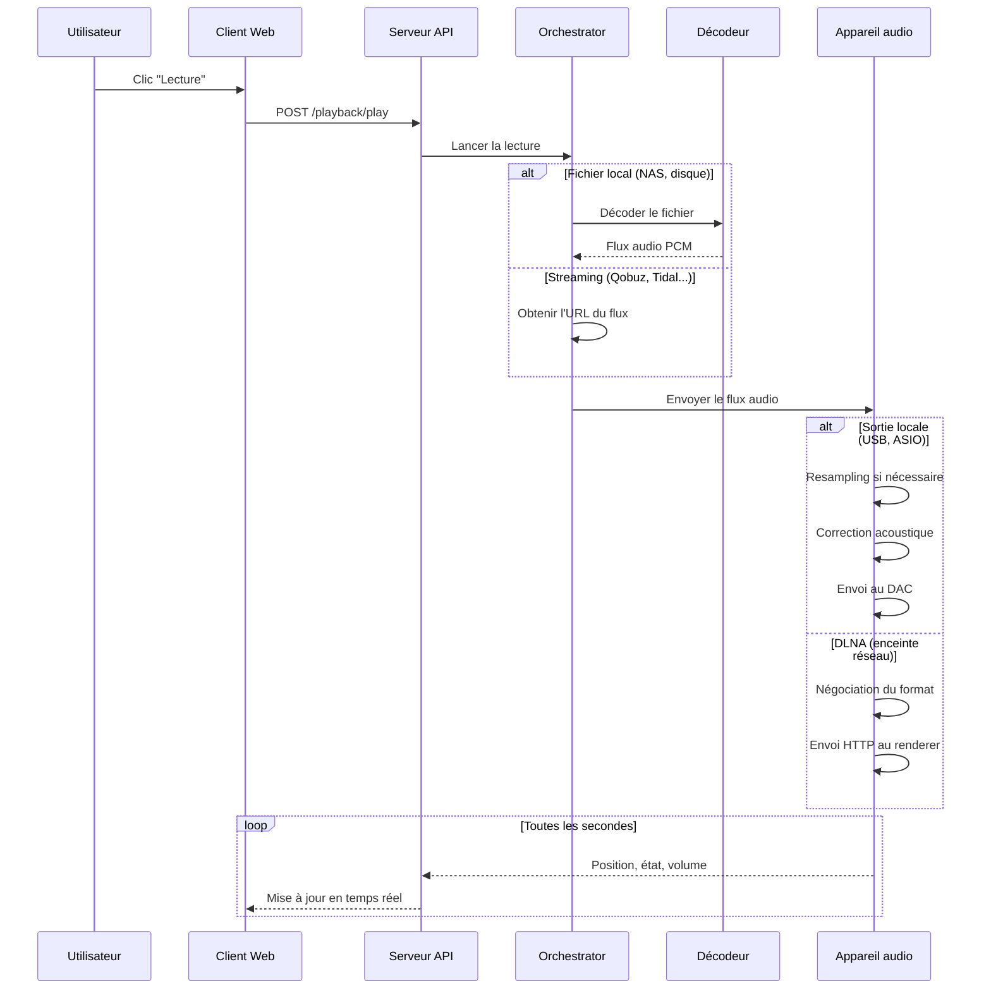
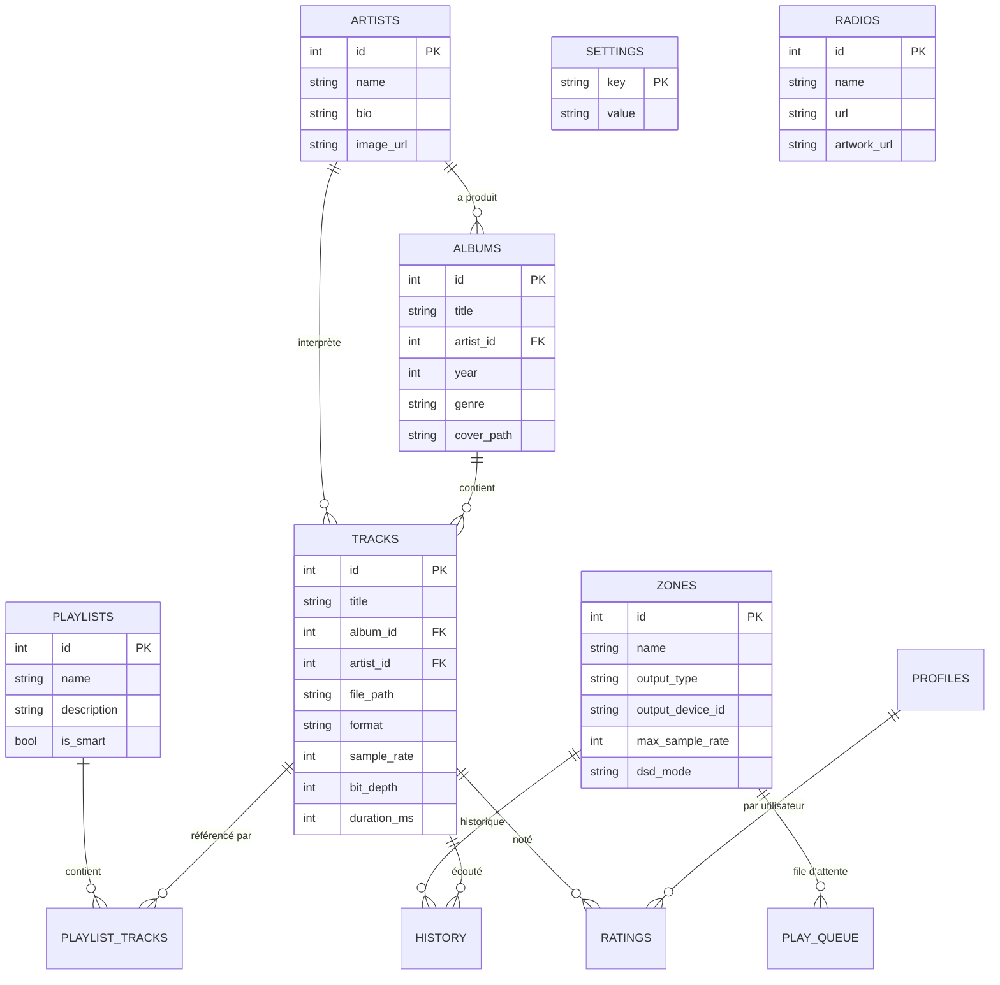

# Tune Server — Architecture logicielle

## Qu'est-ce que Tune ?

Tune est un **serveur audio multiroom haute-fidélité** entièrement écrit en Rust. Il gère la lecture de musique locale et streaming (Qobuz, Tidal, Spotify...) vers n'importe quel appareil audio du réseau (enceintes DLNA, AirPlay, Chromecast, Sonos...).

### Le projet en chiffres

| | |
|---|---|
| **Langage** | Rust (100%) |
| **Modules** | 6 composants principaux |
| **Formats audio** | FLAC, WAV, DSD, AIFF, MP3, AAC, ALAC, APE, WavPack, Opus |
| **Sorties supportées** | 15 types (DLNA, AirPlay, Chromecast, Sonos, ASIO...) |
| **Services streaming** | 7 plateformes (Qobuz, Tidal, Spotify, Deezer...) |

---

\newpage

## Vue d'ensemble

L'architecture suit un modèle en couches. Chaque couche a une responsabilité claire.

---

\newpage

## Les 6 modules du projet

| Module | Rôle |
|--------|------|
| **tune-core** | Le cerveau : traitement audio, base de données, appareils, streaming, plugins |
| **tune-server** | La facade : API HTTP, authentification, WebSocket, routes |
| **tune-cli** | Outil en ligne de commande pour administrer le serveur |
| **tune-bridge** | Passerelle cloud pour l'accès distant au serveur |
| **tune-ffi** | Interface C pour embarquer Tune dans les apps mobiles (Flutter, iOS) |
| **tune-pyo3** | Extension Python pour compatibilité avec l'ancien serveur |

---

\newpage

## Le moteur audio (tune-core)

Le coeur du système, découpé en sous-systèmes indépendants :

---

\newpage

## Architecture modulaire et plugins

Tune est concu pour être extensible. Le système de plugins permet d'ajouter des fonctionnalités sans modifier le coeur du serveur.

### Principes d'extensibilité

| Mécanisme | Description |
|-----------|-------------|
| **Plugin SDK** | Kit de développement permettant de créer des plugins en Rust |
| **Chargement dynamique** | Les plugins sont chargés au démarrage sans recompilation |
| **Points d'extension** | 8 points d'accroche : décodeurs, sorties, services, métadonnées, DSP, UI, événements, commandes |
| **Marketplace** | Catalogue intégré pour découvrir et installer des plugins |
| **Isolation** | Chaque plugin tourne dans son propre contexte avec permissions contrôlées |

### Points d'extension du plugin SDK

### Exemples de plugins existants

| Plugin | Fonction | Statut |
|--------|----------|--------|
| **Last.fm Scrobbler** | Envoie l'historique d'écoute à Last.fm | Intégré |
| **Correction acoustique** | Convolution FIR pour correction de salle | Intégré |
| **Égaliseur paramétrique** | EQ pro avec presets par zone | Intégré |
| **Radio metadata** | Récupération des métadonnées ICY/Shoutcast | Intégré |
| **Sleep timer** | Arrêt programmé de la lecture | Intégré |
| **Auto DJ** | Génération de playlists par IA | Intégré |

---

\newpage

## Comment une piste est jouée

Ce diagramme montre le parcours d'une piste, du clic utilisateur jusqu'au son dans les enceintes.

---

\newpage

## Les appareils de sortie supportés

Tune peut envoyer le son vers 15 types d'appareils différents :

### Sortie locale (connexion directe au DAC)

| Type | Plateforme | Bit-perfect | DSD natif |
|------|-----------|-------------|-----------|
| **Audio standard** | macOS, Windows, Linux | Non | Via DoP |
| **CoreAudio exclusif** | macOS | Oui | Via DoP |
| **ASIO exclusif** | Windows | Oui | Via DoP |
| **WASAPI exclusif** | Windows | Oui | Via DoP |

### Sortie réseau (enceintes et streamers)

| Protocole | Exemples d'appareils | Gapless | Volume | DSD |
|-----------|---------------------|---------|--------|-----|
| **DLNA/UPnP** | Denon, Marantz, HiFi Rose, Micromega | Oui | Oui | Passthrough |
| **OpenHome** | Linn, Naim, dCS | Oui | Oui | Passthrough |
| **Sonos** | Toute la gamme Sonos | Oui | Oui | Non |
| **AirPlay** | Apple TV, HomePod, enceintes AirPlay | Non | Oui | Non |
| **Chromecast** | Google Nest, enceintes Cast | Non | Oui | Non |
| **BluOS** | Bluesound Node, NAD | Non | Oui | Non |
| **Squeezebox** | Logitech Squeezebox, Squeezelite | Oui | Oui | Non |
| **HQPlayer** | Signalyst HQPlayer | Non | Oui | Natif |

### Multiroom

| Protocole | Description |
|-----------|-------------|
| **OAAT** | Open Advanced Audio Transport — protocole de synchronisation multiroom développé pour Tune. Synchronisation sub-milliseconde entre les zones via UDP multicast. |
| **Groupes de zones** | Regroupement logique de plusieurs appareils pour lecture synchronisée |

---

\newpage

## Les services de streaming

| Service | Qualité maximale | Authentification |
|---------|-----------------|------------------|
| **Qobuz** | FLAC 24 bits / 192 kHz | Identifiant + mot de passe |
| **Tidal** | FLAC Hi-Res | OAuth (PKCE) |
| **Spotify** | 320 kbps | OAuth + Spotify Connect |
| **Deezer** | FLAC CD | OAuth |
| **Amazon Music** | Ultra HD (24/192) | OAuth |
| **YouTube Music** | AAC 256 kbps | OAuth (PKCE) |
| **Podcasts** | Variable | Flux RSS (pas d'auth) |

---

## La base de données

Tune supporte deux moteurs de base de données via une couche d'abstraction commune :

- **SQLite** : utilisé par défaut (desktop, Docker). Fichier unique, aucune installation.
- **PostgreSQL** : pour les serveurs de production. Meilleure gestion des accès concurrents.

### Schéma des tables principales

### Les 14 tables

| Table | Rôle |
|-------|------|
| **artists** | Artistes avec biographie et image |
| **albums** | Albums avec pochette, année, genre |
| **tracks** | Pistes avec chemin fichier, format, qualité audio |
| **zones** | Zones de lecture (chaque appareil = une zone) |
| **playlists** | Playlists manuelles et intelligentes |
| **play_queue** | File d'attente par zone |
| **history** | Historique d'écoute |
| **ratings** | Notes utilisateur (1 à 5 étoiles) |
| **radios** | Stations de radio internet |
| **settings** | Paramètres clé-valeur |
| **profiles** | Profils multi-utilisateurs |
| **tags** | Tags personnalisés |
| **source_links** | Liens vers les services de streaming (Qobuz ID, Tidal ID...) |
| **track_metadata** | Métadonnées enrichies (MusicBrainz, Last.fm) |

---

\newpage

## L'API — Principaux endpoints

Le serveur expose une API REST avec plus de 67 groupes d'endpoints.

### Lecture et contrôle

| Endpoint | Action |
|----------|--------|
| `POST /playback/play` | Lancer la lecture |
| `POST /playback/pause` | Mettre en pause |
| `POST /playback/stop` | Arrêter |
| `POST /playback/next` | Piste suivante |
| `POST /playback/seek` | Avancer/reculer dans la piste |
| `POST /playback/volume` | Régler le volume |

### Bibliothèque

| Endpoint | Action |
|----------|--------|
| `GET /library/albums` | Liste des albums |
| `GET /library/artists` | Liste des artistes |
| `GET /library/tracks` | Liste des pistes |
| `GET /library/search` | Recherche plein texte |
| `POST /system/scan` | Lancer un scan de la bibliothèque |

### Zones et appareils

| Endpoint | Action |
|----------|--------|
| `GET /zones` | Liste des zones de lecture |
| `POST /zones` | Créer une zone |
| `DELETE /zones/:id` | Supprimer une zone |
| `GET /devices` | Appareils découverts sur le réseau |

### Streaming

| Endpoint | Action |
|----------|--------|
| `GET /streaming/:service/search` | Rechercher sur un service |
| `GET /streaming/:service/albums/:id` | Détail d'un album |
| `POST /streaming/:service/auth` | Authentification |

---

\newpage

## Compilation conditionnelle

Le même code source produit des binaires différents selon les plateformes, grâce à des **drapeaux de compilation** :

| Drapeau | Par défaut | Description |
|---------|-----------|-------------|
| `local-audio` | Oui | Active la sortie audio locale (USB, casque) |
| `asio` | Non | Active le support ASIO (Windows, audio pro) |
| `oaat` | Oui | Active le protocole multiroom OAAT |
| `cloud-relay` | Oui | Active la connexion au cloud Mozaik Labs |
| `postgres` | Non | Active le support PostgreSQL |

---

## Points d'attention pour l'architecte

1. **L'Orchestrator est central** — Point unique de décision pour le routage audio. Sa complexité croît avec chaque nouveau type de sortie ou format. Candidat pour un refactoring en pattern Strategy.

2. **Le Poller (boucle de surveillance)** — Boucle à 1 Hz qui surveille l'état de toutes les zones, gère le gapless, les transitions, le volume. Code dense. Candidat pour une refonte en machine à états.

3. **Double base de données** — SQLite et PostgreSQL coexistent via une couche d'abstraction. Les requêtes SQL utilisent des placeholders dynamiques. Risque de divergence entre les deux moteurs.

4. **15 implémentations de sortie** — Chaque protocole (DLNA, AirPlay, Chromecast...) a sa propre implémentation derrière un trait commun `OutputTarget`. La couverture de tests est inégale selon les protocoles.

5. **Système de plugins** — Le SDK est fonctionnel avec 6 points d'extension. L'isolation des plugins et la gestion des dépendances restent à renforcer pour un usage tiers.

6. **Interface mobile (FFI)** — L'API C pour Flutter/iOS est minimale (4 fonctions exposées). Elle mériterait un enrichissement pour exploiter les capacités natives des plateformes.
